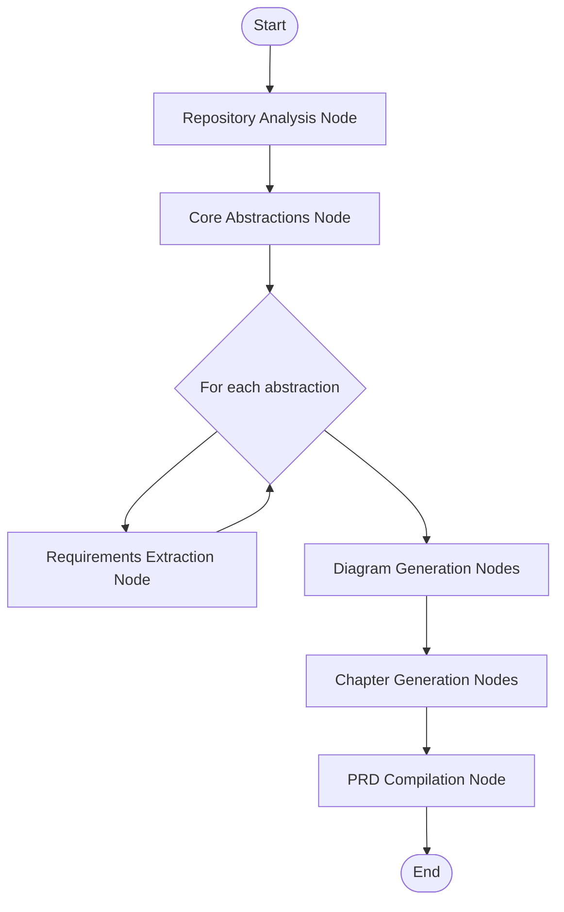
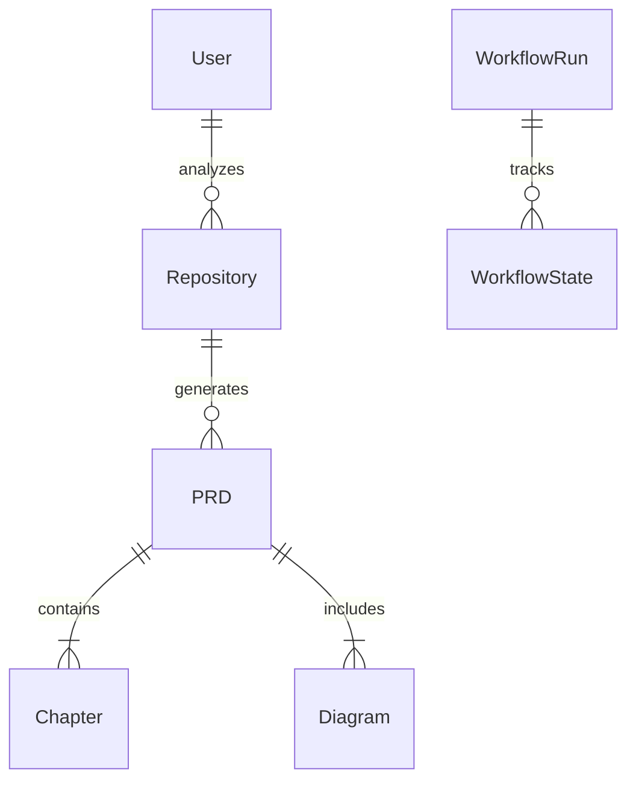

# Gitlify Architecture and Implementation Guide

This document provides a comprehensive overview of Gitlify's architecture and implementation approach, serving as a reference for developers working on the platform.

## System Overview

Gitlify is a web application that leverages local Large Language Models (LLMs) to reverse-engineer Project Requirement Documents (PRDs) from GitHub repositories. The system:

1. Extracts implicit requirements from code
2. Generates detailed specifications and architecture diagrams
3. Organizes findings into structured, navigable chapters
4. Provides community curation and feedback mechanisms

## Core Architecture Components

### 1. Web Application Layer

- **Next.js App Router**: Server components and API routes
- **React Frontend**: Progressive, responsive UI
- **Authentication**: GitHub OAuth integration for user identity

### 2. Repository Processing Layer

- **GitHub API Integration**: Repository data retrieval
- **Code Analysis**: Structure parsing and key file identification
- **Caching**: Efficient repository data storage

### 3. PRD Generation Layer

- **PocketFlow Workflow**: Node-based processing pipeline
- **LLM Integration**: Local model orchestration
- **State Management**: Persistent workflow state tracking

### 4. Data Storage Layer

- **PostgreSQL Database**: Relational data storage
- **Prisma ORM**: Type-safe database access
- **Workflow State Persistence**: Long-running job tracking

### 5. Community Layer

- **PRD Rating System**: Quality evaluation mechanisms
- **Comments and Feedback**: User input collection
- **PRD Library**: Searchable PRD collection

## PocketFlow Implementation

The heart of Gitlify is the PocketFlow-inspired workflow system that enables processing repositories of any size despite LLM context limitations.

### Node Architecture

Each processing node follows this structure:

```
┌───────────────────────────────────────────────────────┐
│                       Node                            │
├───────────────────────────────────────────────────────┤
│                                                       │
│  ┌─────────┐       ┌─────────┐       ┌─────────────┐  │
│  │  prep   │──────▶│  exec   │──────▶│    post     │  │
│  └─────────┘       └─────────┘       └─────────────┘  │
│                                                       │
└───────────────────────────────────────────────────────┘
   ▲ input                                     output ▼
```

- **prep**: Prepares the LLM prompt and necessary context
- **exec**: Executes the prompt against the configured LLM
- **post**: Processes the LLM response and updates workflow state

### Core Workflow Nodes



1. **Repository Analysis Node**: High-level repository assessment
2. **Core Abstractions Node**: Identification of key system components
3. **Requirements Extraction Nodes**: Per-abstraction requirement extraction
4. **Diagram Generation Nodes**: Architecture visualization creation
5. **Chapter Generation Nodes**: PRD chapter content creation
6. **PRD Compilation Node**: Final document assembly

### State Management

Workflow state is tracked in the database allowing:

- Resumption of interrupted workflows
- Progress tracking for users
- Audit trail of generation steps
- Recovery from failures

## LLM Integration

Gitlify supports multiple local LLM options:

### Ollama Integration

```typescript
class OllamaExecutor implements LLMExecutor {
  constructor(private endpoint: string, private modelName: string) {}

  async execute(prompt: string): Promise<string> {
    const response = await fetch(`${this.endpoint}/api/generate`, {
      method: 'POST',
      headers: { 'Content-Type': 'application/json' },
      body: JSON.stringify({
        model: this.modelName,
        prompt: prompt,
        stream: false
      })
    });

    const data = await response.json();
    return data.response;
  }
}
```

### LM Studio Integration

```typescript
class LMStudioExecutor implements LLMExecutor {
  constructor(private endpoint: string) {}

  async execute(prompt: string): Promise<string> {
    const response = await fetch(`${this.endpoint}/api/completion`, {
      method: 'POST',
      headers: { 'Content-Type': 'application/json' },
      body: JSON.stringify({
        prompt: prompt,
        temperature: 0.7,
        max_tokens: 2048
      })
    });

    const data = await response.json();
    return data.content;
  }
}
```

### Model Selection

The application dynamically selects LLMs based on:

1. Task requirements (code understanding, requirements extraction, etc.)
2. User configuration
3. Available local resources

## Mermaid Diagram Generation

Architecture diagrams are generated using carefully crafted prompts:

```typescript
function createDiagramPrompt(
  diagramType: string,
  abstractions: Abstraction[]
): string {
  return `Create a ${diagramType} diagram using Mermaid syntax that shows the relationships between these components:

${formatAbstractionsForDiagram(abstractions)}

Return only the Mermaid code without explanation.`;
}
```

The system generates three primary diagram types:

1. **Component Diagrams**: System structure visualization
2. **Data Flow Diagrams**: Information movement mapping
3. **Entity Relationship Diagrams**: Data model visualization

## PRD Chapter Organization

PRDs are organized into progressive chapters for optimal comprehension:

```
1. Executive Summary
   └── High-level overview of the project

2. User Personas
   └── Target users and their needs

3. Functional Requirements
   ├── Core features
   └── User interactions

4. Non-Functional Requirements
   ├── Performance considerations
   ├── Security requirements
   └── Scalability needs

5. Architecture
   ├── Component overview
   ├── Data flow
   └── Entity relationships

6. Implementation Considerations
   ├── Technical constraints
   ├── Dependencies
   └── Deployment considerations
```

## API Architecture

Gitlify exposes these core API endpoints:

### Repository Management

- `POST /api/repositories`: Register a repository for analysis
- `GET /api/repositories`: List all registered repositories
- `GET /api/repositories/:id`: Get repository details

### PRD Generation

- `POST /api/repositories/:id/generate`: Start PRD generation
- `GET /api/repositories/:id/status`: Check generation status
- `GET /api/repositories/:id/prd`: Get generated PRD

### Community Features

- `POST /api/prds/:id/ratings`: Rate a PRD
- `POST /api/prds/:id/comments`: Comment on a PRD
- `GET /api/prds`: List PRDs with filtering options

## Database Schema

The core tables in the database are:



These tables enable:

1. Tracking of users and their repositories
2. Storage of generated PRDs and their components
3. Workflow state persistence
4. Community ratings and comments

## Implementation Approach

### Phase 1: Foundation

1. Setup Next.js application with basic UI
2. Implement GitHub repository fetching
3. Create database schema and Prisma models
4. Implement authentication system

### Phase 2: Core PRD Generation

1. Implement PocketFlow node system
2. Create repository analysis workflow
3. Implement LLM integration
4. Develop basic PRD generation pipeline

### Phase 3: Visualization and Navigation

1. Implement Mermaid diagram generation
2. Create chapter-based navigation
3. Develop PRD exploration UI
4. Add diagram rendering capabilities

### Phase 4: Community Features

1. Implement PRD rating system
2. Add commenting functionality
3. Create PRD library with search
4. Develop user profiles and history

### Phase 5: Refinement and Optimization

1. Optimize LLM prompts for better results
2. Improve performance and scalability
3. Enhance error handling and recovery
4. Refine UI/UX based on user feedback

## Performance Considerations

### LLM Performance

- **Batch Processing**: Process repository chunks efficiently
- **Context Optimization**: Minimize token usage with strategic prompting
- **Model Selection**: Use appropriate models for different tasks
- **Caching**: Cache repository data and intermediate results

### Web Application Performance

- **Server Components**: Leverage Next.js server components
- **Static Generation**: Pre-render pages where possible
- **API Optimization**: Efficient API design and caching
- **Progressive Loading**: Show results as they become available

## Security Considerations

1. **Authentication**: Secure user authentication via GitHub OAuth
2. **Authorization**: Proper access controls for repositories and PRDs
3. **Data Protection**: Secure storage of API keys and user data
4. **Rate Limiting**: Prevent API abuse
5. **Sandbox Execution**: Safe execution of LLM operations

## Monitoring and Debugging

1. **Workflow Logging**: Detailed logs for each node execution
2. **State Visualization**: Tools to inspect workflow state
3. **Error Tracking**: Comprehensive error capture and reporting
4. **Performance Monitoring**: Track LLM response times and resource usage

## Conclusion

Gitlify's architecture combines modern web technologies with advanced LLM orchestration to deliver a powerful PRD generation platform. The PocketFlow-inspired approach enables handling repositories of any size, while the chapter-based organization and visualization features make the generated PRDs highly accessible and valuable to users.
