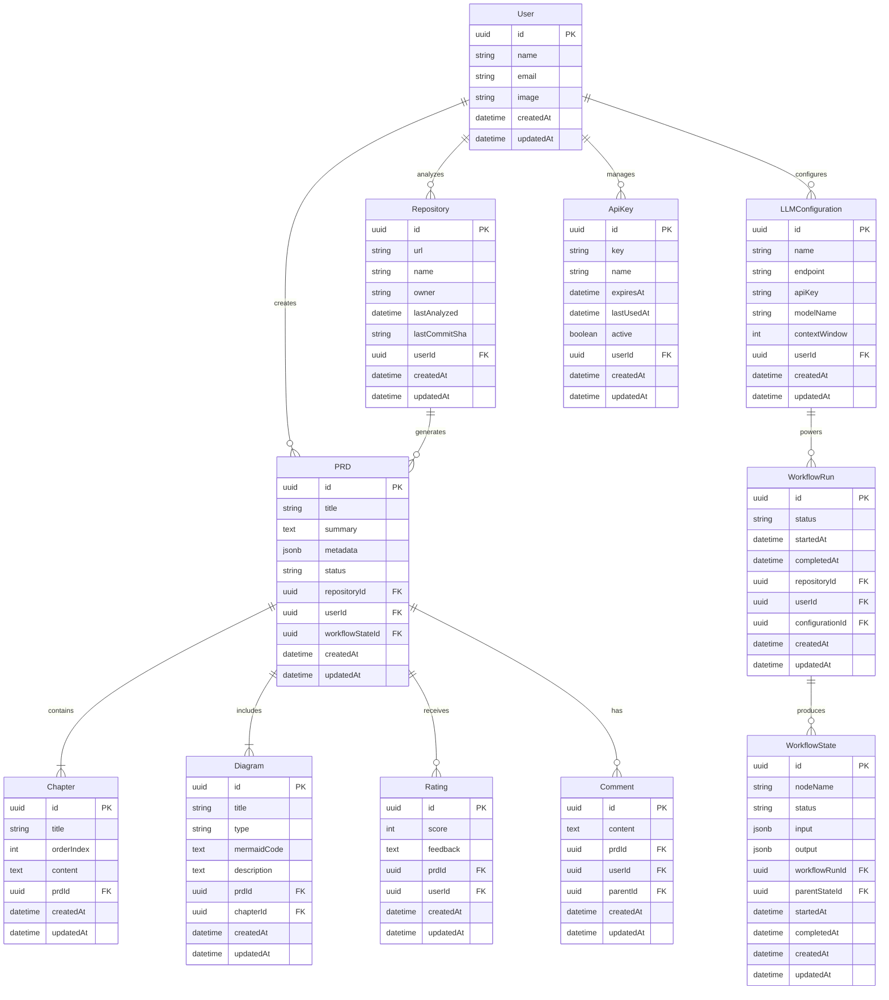

# Database Schema

## Overview

This document defines the database schema for the Gitlify application. The application uses PostgreSQL as the primary database with Prisma ORM for type-safe database access.

## Schema Diagram

## Tables

### User

Stores user account information.

| Column    | Type      | Constraints      | Description                            |
| --------- | --------- | ---------------- | -------------------------------------- |
| id        | UUID      | PK               | Unique identifier for the user         |
| name      | STRING    | NOT NULL         | User's full name                       |
| email     | STRING    | UNIQUE, NOT NULL | User's email address                   |
| image     | STRING    |                  | URL to user's profile image            |
| createdAt | TIMESTAMP | NOT NULL         | When the user account was created      |
| updatedAt | TIMESTAMP | NOT NULL         | When the user account was last updated |

### Repository

Stores information about GitHub repositories that users have analyzed.

| Column        | Type      | Constraints | Description                                |
| ------------- | --------- | ----------- | ------------------------------------------ |
| id            | UUID      | PK          | Unique identifier for the repository       |
| url           | STRING    | NOT NULL    | GitHub repository URL                      |
| name          | STRING    | NOT NULL    | Repository name                            |
| owner         | STRING    | NOT NULL    | Repository owner/organization              |
| lastAnalyzed  | TIMESTAMP |             | When the repository was last analyzed      |
| lastCommitSha | STRING    |             | SHA of the latest commit analyzed          |
| userId        | UUID      | FK          | Reference to the user who owns this record |
| createdAt     | TIMESTAMP | NOT NULL    | When the record was created                |
| updatedAt     | TIMESTAMP | NOT NULL    | When the record was last updated           |

### PRD

Stores generated Project Requirement Documents.

| Column          | Type      | Constraints | Description                                     |
| --------------- | --------- | ----------- | ----------------------------------------------- |
| id              | UUID      | PK          | Unique identifier for the PRD                   |
| title           | STRING    | NOT NULL    | Title of the PRD                                |
| summary         | TEXT      | NOT NULL    | Executive summary of the PRD                    |
| metadata        | JSONB     | NOT NULL    | Additional metadata about the PRD               |
| status          | ENUM      | NOT NULL    | Status (draft/published/archived)               |
| repositoryId    | UUID      | FK          | Reference to the repository                     |
| userId          | UUID      | FK          | Reference to the user who generated the PRD     |
| workflowStateId | UUID      | FK          | Reference to the workflow state that created it |
| createdAt       | TIMESTAMP | NOT NULL    | When the record was created                     |
| updatedAt       | TIMESTAMP | NOT NULL    | When the record was last updated                |

### Chapter

Represents individual sections within a PRD.

| Column     | Type      | Constraints | Description                         |
| ---------- | --------- | ----------- | ----------------------------------- |
| id         | UUID      | PK          | Unique identifier for the chapter   |
| title      | STRING    | NOT NULL    | Title of the chapter                |
| orderIndex | INTEGER   | NOT NULL    | Order of the chapter within the PRD |
| content    | TEXT      | NOT NULL    | Markdown content of the chapter     |
| prdId      | UUID      | FK          | Reference to the PRD                |
| createdAt  | TIMESTAMP | NOT NULL    | When the record was created         |
| updatedAt  | TIMESTAMP | NOT NULL    | When the record was last updated    |

### Diagram

Stores Mermaid diagrams generated for PRDs.

| Column      | Type      | Constraints | Description                                         |
| ----------- | --------- | ----------- | --------------------------------------------------- |
| id          | UUID      | PK          | Unique identifier for the diagram                   |
| title       | STRING    | NOT NULL    | Title of the diagram                                |
| type        | STRING    | NOT NULL    | Type of diagram (component/flow/entity/etc.)        |
| mermaidCode | TEXT      | NOT NULL    | Mermaid syntax code for the diagram                 |
| description | TEXT      | NOT NULL    | Description of what the diagram shows               |
| prdId       | UUID      | FK          | Reference to the PRD                                |
| chapterId   | UUID      | FK          | Reference to the chapter (if specific to a chapter) |
| createdAt   | TIMESTAMP | NOT NULL    | When the record was created                         |
| updatedAt   | TIMESTAMP | NOT NULL    | When the record was last updated                    |

### Rating

Stores user ratings of PRDs.

| Column    | Type      | Constraints | Description                               |
| --------- | --------- | ----------- | ----------------------------------------- |
| id        | UUID      | PK          | Unique identifier for the rating          |
| score     | INTEGER   | NOT NULL    | Numeric rating score (e.g., 1-5)          |
| feedback  | TEXT      |             | Optional feedback on the PRD              |
| prdId     | UUID      | FK          | Reference to the PRD being rated          |
| userId    | UUID      | FK          | Reference to the user who provided rating |
| createdAt | TIMESTAMP | NOT NULL    | When the record was created               |
| updatedAt | TIMESTAMP | NOT NULL    | When the record was last updated          |

### Comment

Stores user comments on PRDs.

| Column    | Type      | Constraints | Description                                 |
| --------- | --------- | ----------- | ------------------------------------------- |
| id        | UUID      | PK          | Unique identifier for the comment           |
| content   | TEXT      | NOT NULL    | Text content of the comment                 |
| prdId     | UUID      | FK          | Reference to the PRD                        |
| userId    | UUID      | FK          | Reference to the user who wrote the comment |
| parentId  | UUID      | FK          | Reference to parent comment (for replies)   |
| createdAt | TIMESTAMP | NOT NULL    | When the record was created                 |
| updatedAt | TIMESTAMP | NOT NULL    | When the record was last updated            |

### LLMConfiguration

Stores configuration for connecting to local LLM servers.

| Column        | Type      | Constraints | Description                                |
| ------------- | --------- | ----------- | ------------------------------------------ |
| id            | UUID      | PK          | Unique identifier for the configuration    |
| name          | STRING    | NOT NULL    | Name of this configuration                 |
| endpoint      | STRING    | NOT NULL    | URL endpoint for the LLM server            |
| apiKey        | STRING    |             | API key if required by the LLM server      |
| modelName     | STRING    | NOT NULL    | Name of the model to use                   |
| contextWindow | INTEGER   | NOT NULL    | Max context window size in tokens          |
| userId        | UUID      | FK          | Reference to the user who owns this config |
| createdAt     | TIMESTAMP | NOT NULL    | When the record was created                |
| updatedAt     | TIMESTAMP | NOT NULL    | When the record was last updated           |

### ApiKey

Stores API keys for external system integration.

| Column     | Type      | Constraints | Description                             |
| ---------- | --------- | ----------- | --------------------------------------- |
| id         | UUID      | PK          | Unique identifier for the API key       |
| key        | STRING    | NOT NULL    | The API key (stored encrypted)          |
| name       | STRING    | NOT NULL    | Name/description of the API key         |
| expiresAt  | TIMESTAMP |             | When the API key expires                |
| lastUsedAt | TIMESTAMP |             | When the API key was last used          |
| active     | BOOLEAN   | NOT NULL    | Whether the API key is active           |
| userId     | UUID      | FK          | Reference to the user who owns this key |
| createdAt  | TIMESTAMP | NOT NULL    | When the record was created             |
| updatedAt  | TIMESTAMP | NOT NULL    | When the record was last updated        |

### WorkflowRun

Tracks execution of PocketFlow-inspired workflows for PRD generation.

| Column          | Type      | Constraints | Description                                 |
| --------------- | --------- | ----------- | ------------------------------------------- |
| id              | UUID      | PK          | Unique identifier for the workflow run      |
| status          | ENUM      | NOT NULL    | Status (pending/running/completed/failed)   |
| startedAt       | TIMESTAMP |             | When the workflow started                   |
| completedAt     | TIMESTAMP |             | When the workflow completed                 |
| repositoryId    | UUID      | FK          | Reference to the repository being analyzed  |
| userId          | UUID      | FK          | Reference to the user who initiated the run |
| configurationId | UUID      | FK          | Reference to the LLM configuration used     |
| createdAt       | TIMESTAMP | NOT NULL    | When the record was created                 |
| updatedAt       | TIMESTAMP | NOT NULL    | When the record was last updated            |

### WorkflowState

Stores state information for nodes in the PocketFlow workflow.

| Column        | Type      | Constraints | Description                                  |
| ------------- | --------- | ----------- | -------------------------------------------- |
| id            | UUID      | PK          | Unique identifier for the workflow state     |
| nodeName      | STRING    | NOT NULL    | Name of the workflow node                    |
| status        | ENUM      | NOT NULL    | Status (pending/running/completed/failed)    |
| input         | JSONB     | NOT NULL    | Input data for the node                      |
| output        | JSONB     | NOT NULL    | Output data from the node                    |
| workflowRunId | UUID      | FK          | Reference to the workflow run                |
| parentStateId | UUID      | FK          | Reference to parent state (for nested flows) |
| startedAt     | TIMESTAMP |             | When the node execution started              |
| completedAt   | TIMESTAMP |             | When the node execution completed            |
| createdAt     | TIMESTAMP | NOT NULL    | When the record was created                  |
| updatedAt     | TIMESTAMP | NOT NULL    | When the record was last updated             |

## Indexes

| Table         | Index Name                  | Columns           | Type   | Description                             |
| ------------- | --------------------------- | ----------------- | ------ | --------------------------------------- |
| User          | User_email_key              | email             | UNIQUE | Ensures unique email addresses          |
| Repository    | Repository_url_userId       | url, userId       | UNIQUE | Prevents duplicate repository entries   |
| Repository    | Repository_userId_idx       | userId            | INDEX  | Speeds up queries by user               |
| PRD           | PRD_repositoryId_idx        | repositoryId      | INDEX  | Speeds up queries by repository         |
| PRD           | PRD_userId_idx              | userId            | INDEX  | Speeds up queries by user               |
| Chapter       | Chapter_prdId_orderIndex    | prdId, orderIndex | INDEX  | Speeds up chapter ordering queries      |
| Diagram       | Diagram_prdId_idx           | prdId             | INDEX  | Speeds up queries by PRD                |
| Diagram       | Diagram_chapterId_idx       | chapterId         | INDEX  | Speeds up queries by chapter            |
| Rating        | Rating_prdId_userId         | prdId, userId     | UNIQUE | Prevents multiple ratings from one user |
| Comment       | Comment_prdId_idx           | prdId             | INDEX  | Speeds up queries by PRD                |
| Comment       | Comment_parentId_idx        | parentId          | INDEX  | Speeds up fetching comment threads      |
| WorkflowRun   | WorkflowRun_repositoryId    | repositoryId      | INDEX  | Speeds up queries by repository         |
| WorkflowState | WorkflowState_workflowRunId | workflowRunId     | INDEX  | Speeds up queries by workflow run       |
| ApiKey        | ApiKey_key_key              | key               | UNIQUE | Ensures unique API keys                 |

## Relationships

- A **User** can have many **Repositories**, **PRDs**, **LLMConfigurations**, and **ApiKeys**
- A **Repository** belongs to a **User** and can have many **PRDs**
- A **PRD** belongs to a **User** and a **Repository**
- A **PRD** can have many **Chapters**, **Diagrams**, **Ratings**, and **Comments**
- A **Chapter** belongs to a **PRD**
- A **Diagram** belongs to a **PRD** and optionally to a specific **Chapter**
- A **Rating** belongs to a **User** and a **PRD**
- A **Comment** belongs to a **User** and a **PRD**, and optionally to a parent **Comment**
- An **LLMConfiguration** belongs to a **User** and can be used in many **WorkflowRuns**
- A **WorkflowRun** belongs to a **User**, a **Repository**, and an **LLMConfiguration**
- A **WorkflowRun** can have many **WorkflowStates**
- A **WorkflowState** belongs to a **WorkflowRun** and optionally to a parent **WorkflowState**

## Migrations

The initial migration will create all the tables, indexes, and relationships defined above. Subsequent migrations will be documented as they are created.

### Initial Migration

The initial migration creates the database schema with all tables, relationships, and indexes as defined above.

### Future Migrations

As the application evolves, additional migrations will be added to this document to track schema changes over time.
