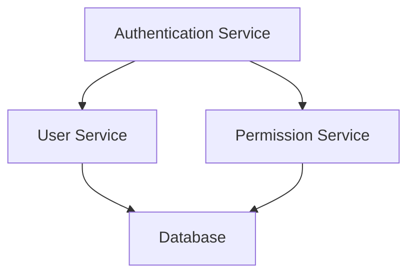
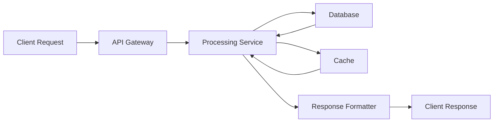
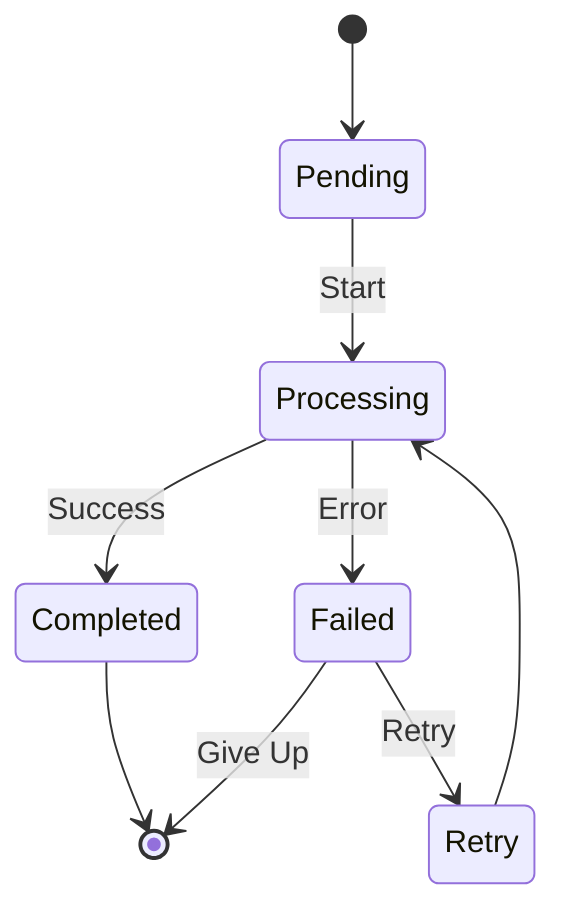
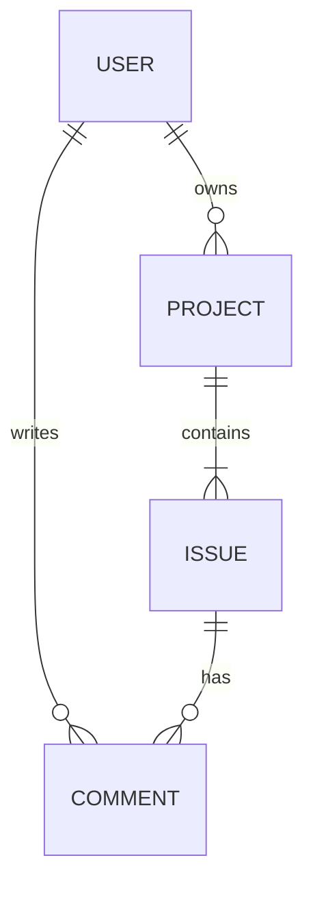
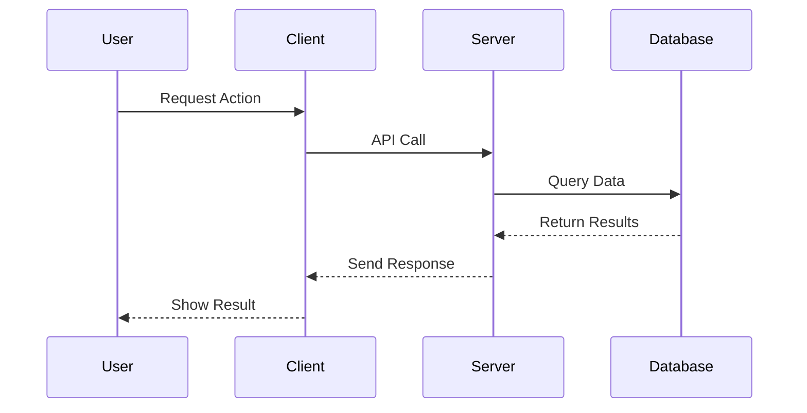
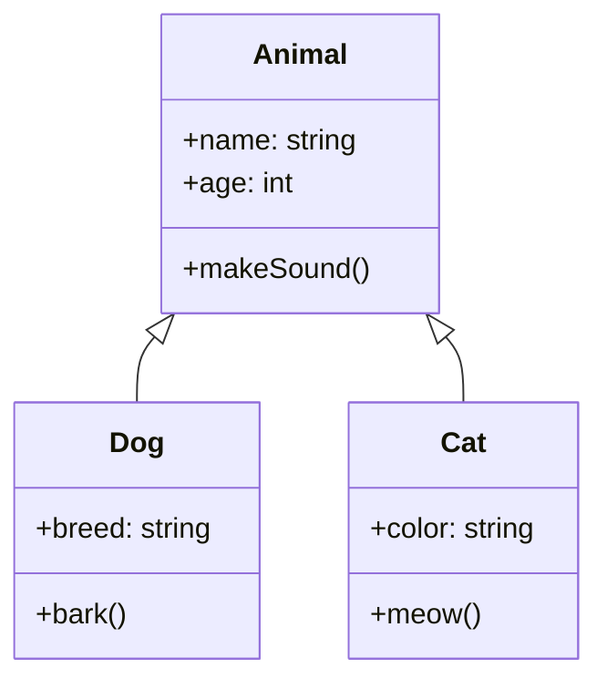

# Mermaid Diagram Guide for Gitlify PRDs

This guide explains how Gitlify uses Mermaid diagrams to visualize software architecture and relationships in generated PRDs.

## Introduction to Mermaid

Mermaid is a JavaScript-based diagramming and charting tool that renders Markdown-inspired text definitions to create and modify diagrams dynamically. Gitlify uses Mermaid to automatically generate visual representations of software architecture from analyzed repositories.

## Diagram Types in Gitlify PRDs

Gitlify generates several types of diagrams to help users understand different aspects of a codebase:

### 1. Component Diagrams

**Purpose**: Show the high-level components of the system and their relationships.

**Example**:

**When Used**: In the Architecture chapter to provide an overview of system structure.

### 2. Data Flow Diagrams

**Purpose**: Illustrate how data moves through the system.

**Example**:

**When Used**: In the Data Flow section to show how information is processed.

### 3. State Diagrams

**Purpose**: Visualize the different states of the system or its components.

**Example**:

**When Used**: In the Behavior section to explain state transitions.

### 4. Entity Relationship Diagrams

**Purpose**: Show the relationships between data entities.

**Example**:

**When Used**: In the Data Model chapter to describe the database schema.

### 5. Sequence Diagrams

**Purpose**: Illustrate the interaction between components over time.

**Example**:

**When Used**: In the Interaction Patterns section to show communication flows.

### 6. Class Diagrams

**Purpose**: Display the structure of classes in object-oriented code.

**Example**:

**When Used**: In the Implementation Details chapter for object-oriented codebases.

## Reading Gitlify Diagrams

### Nodes and Labels

- **Rectangular boxes** represent components, services, or entities
- **Text within boxes** is the name or description
- **Diamond shapes** typically represent decision points
- **Cylindrical shapes** often represent databases or storage

### Relationships

- **Arrows** show direction of dependency or data flow
- **Solid lines** indicate direct dependencies
- **Dashed lines** typically represent indirect or optional relationships
- **Labels on arrows** explain the nature of the relationship

### Common Patterns

Look for these common patterns in the diagrams:

1. **Layered Architecture**: Components arranged in horizontal layers
2. **Client-Server**: Clear separation between client and server components
3. **Microservices**: Multiple small, independent services
4. **Event-Driven**: Components communicating through events
5. **MVC/MVVM**: Model-View-Controller or Model-View-ViewModel patterns

## Customizing Diagrams

When using Gitlify-generated PRDs as a basis for your implementation, you can modify the diagrams to reflect your design changes:

1. Find the Mermaid code block in the markdown file
2. Edit the code to reflect your changes
3. Render the diagram to see the updated visualization

## Exporting Diagrams

Gitlify allows exporting diagrams in several formats:

1. **PNG**: For inclusion in documents or presentations
2. **SVG**: For scalable vector graphics
3. **Markdown**: Raw Mermaid code for further editing

## Best Practices for Using Diagrams

1. **Start with high-level diagrams** to understand the overall system
2. **Dive deeper** into specific areas of interest using more detailed diagrams
3. **Compare diagrams with code** to verify understanding
4. **Use diagrams as discussion points** when planning your implementation
5. **Update diagrams** as your understanding or design evolves

## Technical Implementation

Gitlify uses the following approach to generate diagrams:

1. The LLM analyzes codebase to identify components and relationships
2. The Diagram Generator node creates appropriate Mermaid syntax
3. The PRD Assembler incorporates diagrams at relevant points in the document
4. The frontend renders diagrams using the Mermaid.js library

## Troubleshooting

If diagrams don't render correctly:

1. Check that your markdown viewer supports Mermaid
2. Verify the Mermaid syntax is correct
3. Try simplifying complex diagrams
4. Ensure the latest version of Mermaid.js is being used
