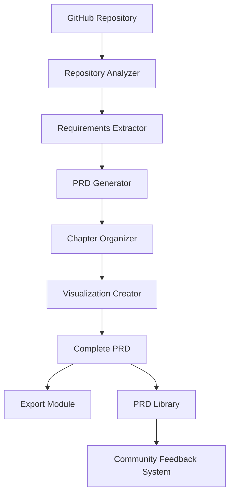

# Gitlify: Project Requirements Document

## Project Overview

**Gitlify** is a platform designed to reverse-engineer comprehensive Project Requirement Documents (PRDs) from public GitHub repositories. The platform analyzes repositories to extract implicit requirements, design decisions, and architectural patterns, then presents them as detailed PRDs. These documents enable developers to rebuild projects from scratch based on requirements rather than code, fostering deeper understanding and facilitating meaningful contributions to open-source projects.

### Value Proposition

Developers struggle with understanding and contributing to unfamiliar codebases. Gitlify solves this by:

- Extracting comprehensive requirements from existing code to reveal the "why" behind implementation decisions
- Creating standardized PRD formats that follow industry best practices
- Building a community-curated library of high-quality software requirement documents
- Enabling developers to rebuild projects from requirements rather than copying code
- Facilitating innovation by allowing developers to implement alternative solutions to the same requirements
- Providing a platform to compare rebuilt implementations with original repositories
- Creating paths for meaningful open-source contributions based on novel implementations

## Core Capabilities

### 1. Repository Analysis & PRD Generation

- **Repository Selection**: Browse or input public GitHub repositories
- **Intelligent Analysis**: Extract implicit and explicit requirements from codebases
- **Comprehensive PRD Creation**: Generate structured documents covering all aspects of the project
- **Requirements Categorization**: Organize requirements into functional, non-functional, and technical sections
- **User Stories Extraction**: Identify intended users and their needs from the implementation
- **Design Decision Documentation**: Capture architectural and implementation choices
- **Technology Stack Analysis**: Document dependencies, frameworks, and libraries used
- **Architecture Visualization**: Generate Mermaid diagrams showing component relationships and system architecture

### 2. Progressive Chapter-Based Organization

- **Modular PRD Structure**: Split PRDs into logical chapters for better comprehension
- **Overview-to-Detail Approach**: Start with high-level concepts before diving into specifics
- **Context-Aware Navigation**: Allow users to move between related sections easily
- **Large Repository Handling**: Process repositories in chunks to manage context limitations
- **Hierarchical Documentation**: Organize information in a natural learning progression
- **Visual Learning Aids**: Include diagrams at appropriate points to reinforce understanding

### 3. PRD Library & Management

- **Personal PRD Collection**: Save and organize generated PRDs
- **Categorization System**: Browse PRDs by technology, domain, or complexity
- **Search Functionality**: Find specific types of projects or requirements
- **Export Options**: Download PRDs in various formats (PDF, Markdown, HTML)
- **Version Control**: Track changes to PRDs over time
- **Comparison Tools**: Compare PRDs from similar projects

### 4. Community Curation

- **Rating System**: Community voting on PRD quality and accuracy
- **Review Mechanism**: Detailed feedback on PRD completeness
- **Contribution Framework**: Community improvements to generated PRDs
- **Reputation System**: Recognition for valuable contributors
- **Follower Functionality**: Subscribe to users who create quality PRDs
- **Notification System**: Updates on PRDs of interest

### 5. Rebuild Support

- **Implementation Guidance**: Tips for rebuilding from requirements
- **Reference Resources**: Links to relevant documentation and learning materials
- **Rebuild Tracking**: Document personal progress on implementations
- **Comparison Tools**: Compare rebuilt projects to original repositories
- **Innovation Highlights**: Identify areas where implementations improve on originals
- **Contribution Pathways**: Guidelines for submitting improvements to original projects

## PRD Structure & Format

### Modular Organization

PRDs will be organized into logical chapters following a progressive learning approach:

1. **Project Overview**: High-level summary of the project's purpose and value
2. **Core Concepts**: Fundamental abstractions and design patterns used
3. **Architecture**: System structure and component relationships (with diagrams)
4. **Functional Requirements**: Detailed specifications for features and capabilities
5. **Technical Requirements**: Implementation constraints and considerations
6. **User Experience**: Flow and interaction specifications
7. **Data Model**: Entity relationships and persistence requirements
8. **API Design**: Interface specifications for services and components
9. **Implementation Considerations**: Notes on technology choices and trade-offs

### Architecture Visualization

Each PRD will include multiple Mermaid diagrams to visualize:

- **Component Relationships**: How different parts of the system interact
- **Data Flow**: How information moves through the system
- **State Transitions**: How the system changes states based on events
- **Entity Relationships**: How data entities relate to each other
- **Deployment Architecture**: How the system is deployed and scaled

Example of a Mermaid diagram in the PRD:

## User Experience

1. **Discovery Phase**:

   - Browse curated repositories or enter a GitHub URL
   - View repository overview and complexity assessment
   - Initiate PRD generation process

2. **PRD Exploration**:

   - Navigate through progressive chapters from overview to details
   - Explore user stories, functional requirements, and technical specifications
   - Interact with visual diagrams showing system architecture
   - Export PRD in preferred format

3. **Community Interaction**:

   - Rate and review PRDs for accuracy and completeness
   - Suggest improvements or corrections
   - Follow top contributors and receive updates

4. **Implementation Phase**:
   - Use PRD as basis for personal implementation
   - Track progress through requirements
   - Compare implementation with original repository
   - Identify improvements and potential contributions

## Technology Components

### Repository Analysis

- GitHub API integration for repository access
- Code parsing and structure analysis
- Requirement extraction algorithms
- Design pattern recognition
- Documentation assessment
- Chunk-based processing for large repositories

### PRD Generation

- Template-based document creation
- Context-aware requirement organization
- Technical specification formatting
- User story generation
- Design decision documentation
- Mermaid diagram generation
- Progressive chapter organization

### LLM Integration

- Connection to local LLM services (Ollama, LM Studio)
- Optimized prompting for requirement extraction
- Context window management for large repositories
- Response processing and validation
- Error handling and fallback mechanisms
- PocketFlow-inspired workflows for complex processes

### Community Platform

- User authentication and profiles
- Rating and review systems
- Content moderation tools
- Notification framework
- Social features (following, sharing)

### User Interface

- Repository browser and search
- Chapter-based PRD navigator
- Interactive diagram viewer
- Export functionality
- Implementation tracking
- Community interaction components

## Development Phases

### Phase 1: Core PRD Generation

- Repository fetching and analysis
- Basic PRD generation
- Simple architecture diagram creation
- Export functionality
- User accounts and saved PRDs

### Phase 2: Enhanced PRD Quality

- Improved requirement extraction
- Better categorization and organization
- Chapter-based PRD structure
- Advanced Mermaid diagrams
- Quality assessment tools

### Phase 3: Community Features

- Rating and review system
- Contribution mechanisms
- User profiles and reputation
- PRD sharing functionality

### Phase 4: Rebuild Support

- Implementation guidance
- Comparison tools
- Contribution preparation
- Innovation highlighting

## Success Criteria

1. Users successfully rebuild projects based on generated PRDs
2. Community actively contributes to and improves PRDs
3. PRD library grows with diverse, high-quality requirements documents
4. Users report meaningful contributions to original repositories
5. Platform becomes recognized as a valuable resource for learning software design
6. Developers use Gitlify as a standard tool for understanding open-source projects
7. Educational institutions adopt Gitlify for teaching software requirements

## Technical Implementation

The project will be built using:

- Next.js 14+ with App Router for the web platform
- TypeScript for type-safe development
- PostgreSQL with Prisma ORM for data persistence
- GitHub API integration for repository access
- Local LLM integration for code analysis and PRD generation
- TailwindCSS with Shadcn UI components for the interface
- Mermaid.js for architecture diagram generation
- PocketFlow-inspired workflow for LLM orchestration

## Future Enhancements

1. **Enterprise Features**: Private repositories and team collaboration
2. **Educational Tools**: Curriculum integration for teaching software requirements
3. **Advanced Analytics**: Insights into common patterns across successful projects
4. **Specialized PRD Templates**: Industry and domain-specific requirement formats
5. **Historical Analysis**: How requirements evolved throughout project history
6. **Interactive Q&A**: Ability to ask questions about specific parts of the PRD

## Key Stakeholders

- **End Users**: Software developers, students, open-source contributors
- **Product Owner**: Responsible for product vision and prioritization
- **Development Team**: Responsible for implementation and technical decisions
- **Community Moderators**: Overseeing content quality and user interactions

## Out of Scope

1. Automated code generation from PRDs
2. Private repository analysis (future feature)
3. Full project management tools
4. Real-time collaboration on PRDs (future feature)
5. Integration with specific development environments

## Appendices

- [Technical Architecture](./technical-architecture.md)
- [User Journey](./user-journey.md)
- [Sample PRD Template](./sample-prd-template.md)
- [Mermaid Diagram Guide](./mermaid-diagram-guide.md)
