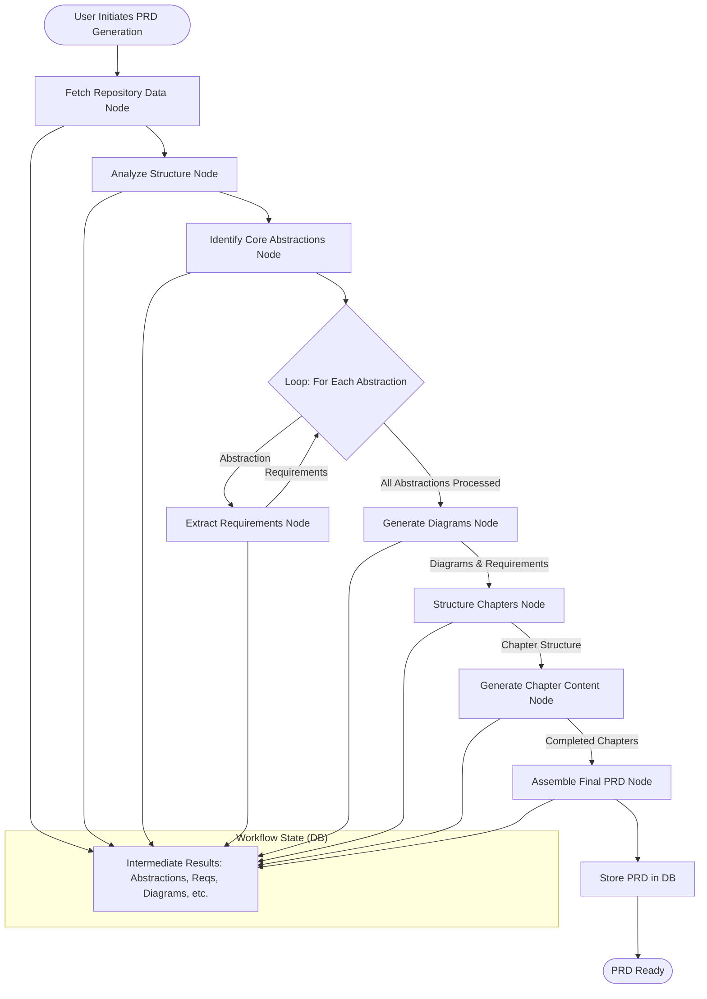

# Technical Architecture

This document outlines the architecture for the Gitlify platform, focusing on the core components needed to deliver PRD generation and community curation functionality. It also covers key implementation considerations.

_Note: This document provides the planned architecture. Specific implementation details may evolve during development._

## Guiding Principles

- **Simplicity First**: Focus on simple, proven technologies
- **Separation of Concerns**: Clear boundaries between components
- **Progressive Enhancement**: Build core features before advanced ones
- **Community-Driven**: Design for community participation and improvement
- **Visualization-Enhanced**: Use diagrams to clarify complex relationships

## High-Level Architecture

The application follows a client-server architecture with emphasis on AI-powered analysis:

```mermaid
graph TD
    subgraph "Client (Browser)"
        A[React UI Components]
        B[Next.js Router]
        C[Repository Explorer]
        A <-- --> B
        B <-- -> C
    end

    subgraph "Server"
        D[API Routes]
        E[Repository Service]
        F[PRD Generation Service]
        G[LLM Orchestrator]
        H[Database]

        D <-- --> E
        D <-- -> F
        F <-- -> G
        E <-- -> H
        F <-- -> H
    end

    subgraph "External Services"
        I[GitHub API]
        J[Local LLM]
    end

    C --> D
    E --> I
    G --> J
```

## Core Architecture Layers & Components

### 1. Web Application Layer (Frontend & UI)

- **Framework**: Next.js 15+ with App Router (Server Components, API Routes)
- **UI Library**: React 19+
- **Styling**: Tailwind CSS v4 with Shadcn/UI components
- **Authentication**: NextAuth.js with GitHub OAuth provider
- **State Management**: React Hooks (useState, useEffect, useContext), potentially Zustand or Jotai for complex global state if needed.
- **Key Components**:
  - `Repository Explorer`: Allows users to find and select repositories.
  - `PRD Viewer`: Displays generated PRDs with navigation and diagram rendering.
  - `Community Interface`: Handles ratings, comments, user profiles.

### 2. Repository Processing Layer (Backend Service)

- **Purpose**: Handles interaction with GitHub and initial analysis.
- **Key Features**:
  - GitHub API Integration (using `lib/github/githubClient.ts`)
  - Repository structure analysis & metadata extraction.
  - Code parsing (potentially using lightweight parsers if needed).
  - Caching of repository data to minimize redundant API calls.
  - Logic for handling large repositories (e.g., analyzing only key files initially).

### 3. PRD Generation Layer (Backend Service)

- **Purpose**: Orchestrates the LLM-powered analysis and PRD construction.
- **Workflow Engine**: PocketFlow-inspired node system (details below).
- **LLM Integration**: Connects to local LLM services via `lib/llm/llmClient.ts`.
- **State Management**: Tracks workflow progress and intermediate results, likely persisted in the database.
- **Diagram Generation**: Uses LLM prompts (see `prompt_engineering.md`) to generate Mermaid syntax.

### 4. Data Storage Layer

- **Database**: PostgreSQL
- **ORM**: Prisma (schema defined in `prisma/schema.prisma`, client setup in `lib/prisma.ts`)
- **Key Data**: User accounts, repository metadata, PRD content (potentially stored as structured JSON or Markdown), chapter details, generated diagrams, workflow states, community feedback (ratings, comments).

### 5. Community Layer (Backend Service & Frontend)

- **Purpose**: Manages user interactions around PRDs.
- **Features**: PRD rating system, commenting engine, user reputation tracking (future phase).
- **Implementation**: Likely involves dedicated API routes and database tables for ratings, comments, etc.

## Technology Stack Summary

| Component       | Technology                                   | Justification                                      |
| --------------- | -------------------------------------------- | -------------------------------------------------- |
| Framework       | Next.js 15+, React 19+                       | Modern full-stack React framework, App Router      |
| Language        | TypeScript                                   | Type safety, improved maintainability              |
| Database        | PostgreSQL, Prisma ORM                       | Robust relational DB, excellent type-safe ORM      |
| Styling         | Tailwind CSS v4, Shadcn/UI                   | Utility-first CSS, pre-built accessible components |
| Authentication  | NextAuth.js (GitHub Provider)                | Simplified authentication setup                    |
| GitHub Access   | Custom Client (`lib/github/githubClient.ts`) | Simple wrapper around fetch for API calls          |
| LLM Integration | Custom Client (`lib/llm/llmClient.ts`)       | Provider-agnostic local LLM communication          |
| Diagramming     | Mermaid.js                                   | Standard text-based diagramming for Markdown       |
| LLM Workflow    | PocketFlow-inspired Node System              | Manages complex, multi-step LLM tasks effectively  |
| Deployment      | Vercel (Frontend/Backend), Supabase (DB)     | Recommended hosting platforms for Next.js/Postgres |
| Analytics       | Plausible/Simple Analytics (Future)          | Privacy-focused analytics                          |

_Note on Client Libraries: We use simple fetch-based wrappers in `lib/` for GitHub and LLM clients currently. If complexity increases, libraries like Octokit.js might be reconsidered._

## LLM Processing Architecture (PocketFlow Implementation)

The core of PRD generation relies on a workflow inspired by PocketFlow, breaking the task into manageable nodes.

### Node Architecture

Each node encapsulates a specific step (prep -> exec -> post):

```
┌───────────────────┐      ┌───────────────────┐      ┌───────────────────┐
│       prep        │────▶ │       exec        │────▶ │       post        │
│ (Prepare Context) │      │ (Call LLM/Service)│      │ (Process Results) │
└───────────────────┘      └───────────────────┘      └───────────────────┘
```

### Core Workflow (Conceptual)



_This is a simplified flow; actual implementation may involve more granular nodes or parallel processing where applicable._

### Workflow State Management

- Workflow progress and intermediate data (extracted requirements, diagram code, etc.) will be stored in the database (see `WorkflowRun`, `WorkflowState` tables in `database_schema.md`).
- This allows for resumability, progress tracking, and debugging.

### Context Window Management

Strategies to handle LLM context limits:

1.  **Chunking**: Process repository files or sections in smaller pieces.
2.  **Summarization/Distillation**: Summarize findings from one step to feed concise context into the next.
3.  **Targeted Analysis**: Focus prompts on specific aspects relevant to the current node's task.
4.  **Vector Embeddings (Future)**: Potentially use embeddings for semantic search within the codebase for highly relevant context retrieval.

## Diagram Generation System

- Leverages LLM prompts based on analyzed abstractions and relationships.
- Generates Mermaid syntax stored in the `Diagram` table.
- Frontend renders diagrams using Mermaid.js library.
- See `mermaid-diagram-guide.md` for types and examples.

## API Architecture Overview

Core API endpoints will be implemented using Next.js API Routes within the `app/api/` directory.

- **`/api/auth/...`**: Handles authentication via NextAuth.js.
- **`/api/repositories`**: Manages user-saved repositories (CRUD).
- **`/api/prds`**: Manages generated PRDs (CRUD, status checks).
- **`/api/prds/[id]/generate`**: Endpoint to trigger PRD generation workflow for a repository.
- **`/api/github/...`**: Proxied requests or direct interactions with GitHub API (e.g., search).
- **`/api/community/...`**: Endpoints for ratings, comments (Future Phase).

_Refer to `api_documentation.md` for more detailed (evolving) endpoint specifications._

## Data Flow Examples

### PRD Generation Flow

1.  User selects repository and clicks "Generate PRD" in the UI.
2.  Frontend calls `POST /api/prds/[repoId]/generate`.
3.  Backend API route validates request, initiates a new `WorkflowRun`.
4.  PocketFlow engine executes nodes sequentially (Fetch -> Analyze -> Extract -> Diagram -> Assemble).
    - Each node interacts with GitHub API or Local LLM via clients in `lib/`.
    - Intermediate state saved via `WorkflowState` records.
5.  Upon completion, final PRD data (chapters, diagrams) is stored in `PRD`, `Chapter`, `Diagram` tables.
6.  WorkflowRun status updated to 'Completed'.
7.  Frontend polls `GET /api/prds/[id]/status` or uses WebSockets (future) to detect completion.
8.  User navigates to the PRD view page, which fetches data from `GET /api/prds/[id]`.

### Community Interaction Flow (Simplified - Future Phase)

1.  User views a PRD.
2.  User submits a rating/comment via UI form.
3.  Frontend calls `POST /api/community/prds/[id]/ratings` or `/comments`.
4.  Backend API validates input, stores rating/comment in the database, potentially updating PRD metadata.
5.  UI updates to reflect the new rating/comment.

## Security and Privacy Considerations

- **Local LLM Focus**: Core principle is that repository code is _not_ sent to external cloud LLMs. Analysis happens locally.
- **GitHub Access**: Primarily uses unauthenticated GitHub API for public data. OAuth is used for user identity, _not_ necessarily for accessing private code (unless explicitly added as a future feature with user consent).
- **Authentication**: Standard practices via NextAuth.js (session cookies, secure secret).
- **Input Sanitization**: API endpoints must sanitize inputs to prevent injection attacks.
- **Dependency Management**: Regularly audit dependencies (`npm audit`) for vulnerabilities.

## Deployment Strategy

- **Frontend/Backend**: Vercel (recommended for Next.js)
- **Database**: Supabase (managed PostgreSQL)
- **Environment Variables**: Use Vercel/Supabase environment variable management for production secrets.

## Development Approach & Performance

- Follow phased approach outlined in `implementation_plan.md`.
- Prioritize efficient database queries (use Prisma query optimization features).
- Implement caching for GitHub API responses and potentially intermediate analysis steps.
- Optimize LLM prompts for speed and cost (token usage).
- Consider background job queues (e.g., using Vercel Serverless Functions with longer timeouts, or external queue like BullMQ/Redis) for long-running PRD generation tasks.
- Frontend performance: Code splitting, lazy loading (especially for diagrams), optimized component rendering.

## Future Technical Enhancements

- Real-time collaboration features (WebSockets).
- Advanced context retrieval using vector embeddings.
- Integration with CI/CD pipelines for automated PRD generation/updates.
- Public API for third-party integrations.
- More sophisticated LLM orchestration (e.g., agent-based systems).
