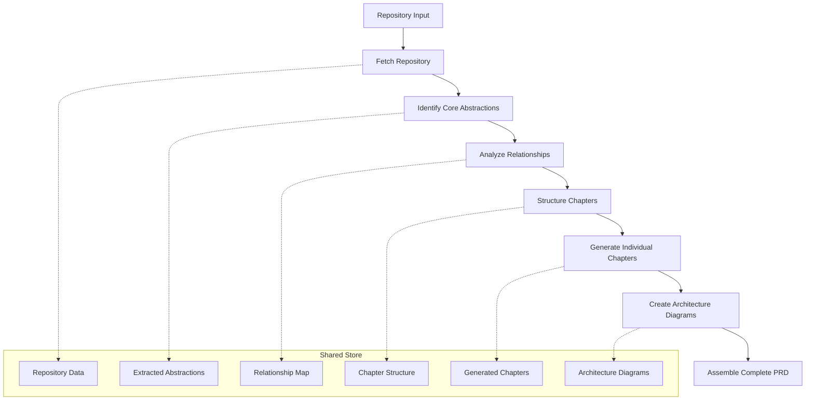
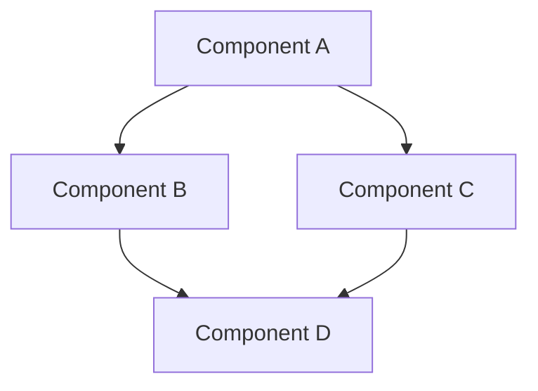
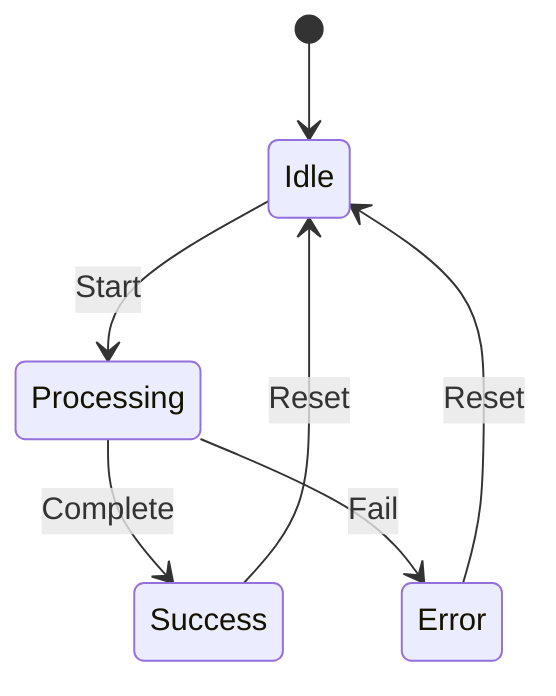
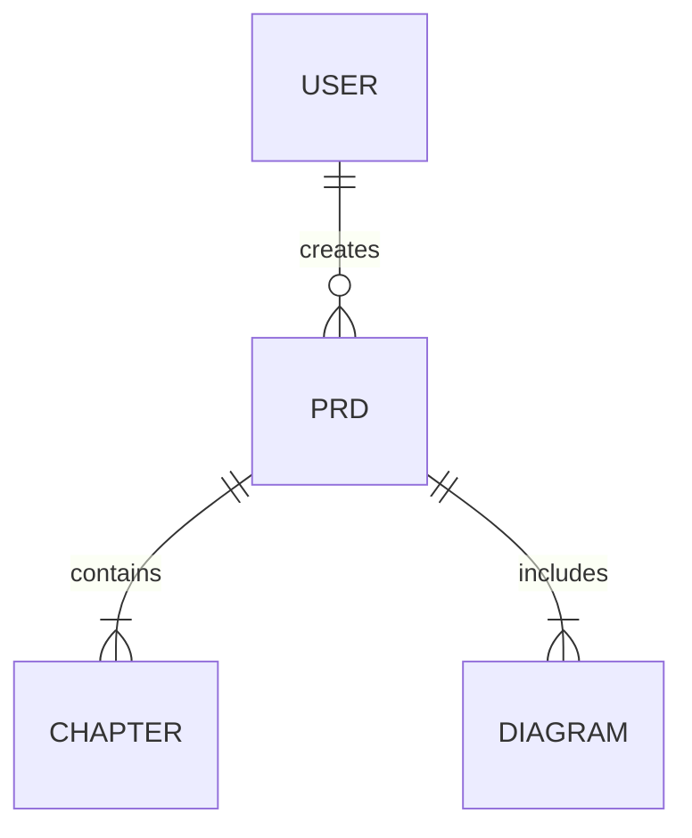
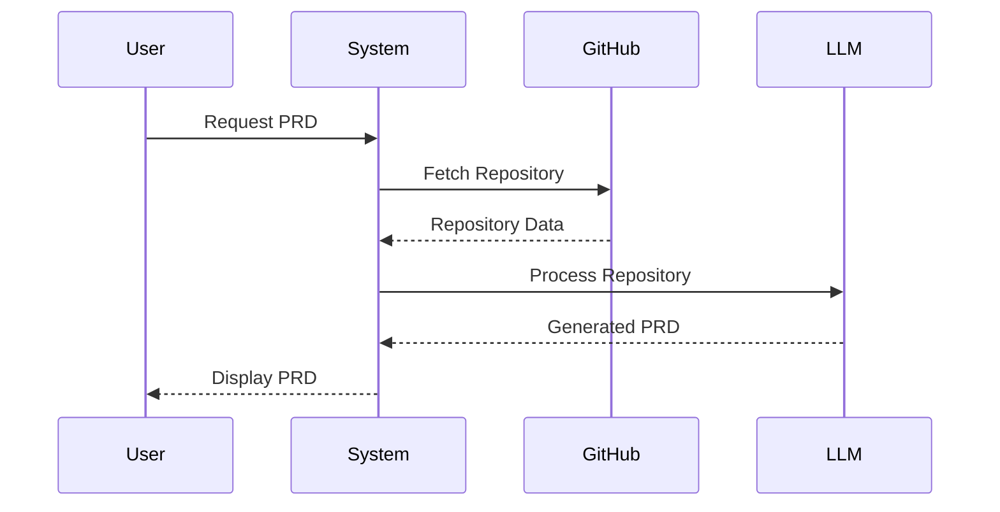

# Technical Architecture

This document outlines the architecture for the Gitlify platform, focusing on the core components needed to deliver PRD generation and community curation functionality.

## Guiding Principles

- **Simplicity First**: Focus on simple, proven technologies
- **Separation of Concerns**: Clear boundaries between components
- **Progressive Enhancement**: Build core features before advanced ones
- **Community-Driven**: Design for community participation and improvement
- **Visualization-Enhanced**: Use diagrams to clarify complex relationships

## High-Level Architecture

The application follows a client-server architecture with emphasis on AI-powered analysis:

```mermaid
graph TD
    subgraph "Client (Browser)"
        A[React UI Components]
        B[Next.js Router]
        C[Repository Explorer]
        A <-- -> B
        B <-- -> C
    end

    subgraph "Server"
        D[API Routes]
        E[Repository Service]
        F[PRD Generation Service]
        G[LLM Orchestrator]
        H[Database]

        D <-- -> E
        D <-- -> F
        F <-- -> G
        E <-- -> H
        F <-- -> H
    end

    subgraph "External Services"
        I[GitHub API]
        J[Local LLM]
    end

    C --> D
    E --> I
    G --> J
```

## Key Components

### 1. Frontend Components

#### Repository Explorer

- **Purpose**: Browse and select GitHub repositories for analysis
- **Key Features**:
  - Repository URL input
  - Curated repository browsing
  - Repository metadata display
  - Analysis initiation

#### PRD Viewer

- **Purpose**: Display and navigate generated PRDs
- **Key Features**:
  - Chapter-based navigation
  - Section collapsing/expanding
  - Interactive diagram rendering
  - Export functionality
  - Print-friendly view

#### Community Interface

- **Purpose**: Enable community interaction with PRDs
- **Key Features**:
  - Rating and review system
  - Comment functionality
  - User profiles
  - PRD sharing tools

### 2. Backend Services

#### Repository Service

- **Purpose**: Fetch and analyze GitHub repository data
- **Key Features**:
  - GitHub API integration
  - Repository structure analysis
  - Code parsing
  - Metadata extraction
  - Large repository chunking

#### PRD Generation Service

- **Purpose**: Transform repository analysis into structured PRDs
- **Key Features**:
  - Requirement extraction workflow
  - Document structuring
  - Chapter organization
  - Template application
  - Export formatting
  - Diagram generation

#### LLM Orchestrator

- **Purpose**: Manage complex LLM workflows for PRD generation
- **Key Features**:
  - PocketFlow-inspired node and flow system
  - Context window management
  - Optimized prompting for requirement extraction
  - Response processing
  - Error handling

### 3. Data Storage

#### Core Database Tables

- **Users**: User accounts and profiles
- **Repositories**: Metadata about analyzed repositories
- **PRDs**: Generated project requirement documents
- **Chapters**: Modular sections of PRDs
- **Diagrams**: Generated architecture visualizations
- **Ratings**: User ratings and reviews of PRDs
- **Comments**: User comments and discussions
- **Templates**: PRD templates and formats

## Technology Stack

For efficient development and scalability, we'll use:

| Component       | Technology                              | Justification                                       |
| --------------- | --------------------------------------- | --------------------------------------------------- |
| Frontend        | Next.js 15+, React 19+, Tailwind CSS v4 | Modern, responsive UI with efficient routing        |
| Backend         | Next.js API routes                      | Unified deployment, serverless architecture         |
| Database        | PostgreSQL, Prisma                      | Type-safe database access, robust ORM               |
| GitHub Access   | Octokit.js                              | Well-maintained GitHub API client                   |
| LLM Integration | REST clients                            | Flexible integration with various LLM providers     |
| UI Components   | Shadcn/UI                               | Consistent, accessible interface components         |
| CSS Framework   | Tailwind CSS v4 (@tailwindcss/postcss)  | Modern utility-first CSS with updated plugin system |
| Diagramming     | Mermaid.js                              | Industry-standard diagram rendering in Markdown     |
| LLM Workflow    | PocketFlow-inspired                     | Simple, transparent orchestration of LLM operations |

## LLM Processing Architecture

Inspired by PocketFlow's simplicity and effectiveness, our LLM workflow system uses a graph-based approach with nodes, flows, and shared stores:



### Workflow Nodes

1. **Fetch Repository Node**

   - **Prep**: Takes repository URL
   - **Exec**: Downloads repository files, excludes irrelevant files
   - **Post**: Stores repository data

2. **Identify Core Abstractions Node**

   - **Prep**: Takes repository data
   - **Exec**: Analyzes codebase to identify key components and concepts
   - **Post**: Stores list of abstractions with descriptions

3. **Analyze Relationships Node**

   - **Prep**: Takes abstractions and repository data
   - **Exec**: Analyzes dependencies and relationships between abstractions
   - **Post**: Stores relationship map

4. **Structure Chapters Node**

   - **Prep**: Takes abstractions and relationships
   - **Exec**: Organizes content into logical chapters
   - **Post**: Stores chapter structure

5. **Generate Individual Chapters Node**

   - **Prep**: Takes chapter structure, abstractions, and relationships
   - **Exec**: Generates detailed content for each chapter
   - **Post**: Stores completed chapters

6. **Create Architecture Diagrams Node**

   - **Prep**: Takes abstractions and relationships
   - **Exec**: Generates Mermaid diagrams showing system architecture
   - **Post**: Stores diagram code

7. **Assemble Complete PRD Node**
   - **Prep**: Takes chapters and diagrams
   - **Exec**: Combines all content into final PRD format
   - **Post**: Stores completed PRD

### Context Window Management

To handle large repositories that would exceed typical LLM context windows:

1. **Chunking Strategy**: Divide repository analysis into logical units
2. **Progressive Loading**: Process repository in stages, carrying forward essential information
3. **Information Distillation**: Summarize key points before proceeding to next stage
4. **Focused Prompting**: Target specific aspects of the codebase in each prompt
5. **Memory Management**: Keep track of already processed information to avoid redundancy

## Diagram Generation System

Gitlify automatically generates multiple types of architectural diagrams:

### Component Diagram



### Data Flow Diagram


### State Diagram



### Entity Relationship Diagram



### Sequence Diagram



## Data Flow

### PRD Generation Flow

1. User inputs a GitHub repository URL or selects from curated list
2. System validates repository and fetches basic metadata
3. User confirms PRD generation
4. System processes repository through the LLM workflow:
   - Fetches repository content
   - Identifies core abstractions
   - Analyzes relationships between components
   - Structures content into logical chapters
   - Generates detailed chapter content
   - Creates architecture diagrams
   - Assembles final PRD
5. PRD is stored in database and presented to user
6. User can navigate through chapters and view diagrams
7. User can review, rate, and share the PRD

### Community Interaction Flow

1. User browses available PRDs
2. User selects PRD of interest
3. System displays PRD with chapter navigation and diagrams
4. User can add ratings, reviews, or comments
5. User can follow PRD creators or share PRDs
6. System updates reputation scores based on community feedback

## Security and Privacy

- GitHub API access limited to public repositories (no authentication required)
- All repository analysis performed locally
- User data protected with modern authentication practices
- Rating and review systems include moderation to prevent abuse

## Deployment Strategy

For optimal performance and cost, we'll use:

- **Frontend/Backend**: Vercel (Next.js hosting)
- **Database**: Supabase (PostgreSQL as a service)
- **Analytics**: Simple privacy-focused analytics (Plausible or similar)

## Development Approach

We'll follow a phased approach to development:

1. **Build Repository Analysis**: Implement GitHub API integration and basic structure analysis
2. **Develop LLM Workflow System**: Create PocketFlow-inspired node/flow system
3. **Implement Diagram Generation**: Build Mermaid diagram generation
4. **Create Chapter-Based PRD Generation**: Implement progressive chapter creation
5. **Add User Features**: Implement user accounts, saved PRDs, and export functionality
6. **Build Community Features**: Develop rating, review, and sharing capabilities

## Performance Considerations

- Efficient caching of GitHub API responses
- Optimization of LLM prompts for better performance
- Progressive loading of PRD content
- Pagination for community features
- Background processing for large repository analysis
- Lazy loading of diagrams in UI

## Future Technical Enhancements

- Advanced AI models for more nuanced requirement extraction
- Real-time collaborative editing of PRDs
- Automated quality assessment of generated PRDs
- Integration with development environments
- API access for third-party applications
- Interactive Q&A system for PRD exploration
